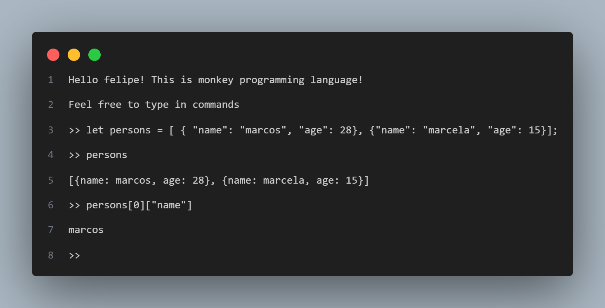

# Writer a interpreter using GO
The learning project based on [Writing an interpreter in Go](https://interpreterbook.com/). 
In this project you can learn about:
- Lexer.
- Parsing.
- Abstract Syntax tree thats is capable to generate the precedence 
- The evaluator thats make the things done.

## How to run
```bash
go run main.go
```


## Languages Features
The monkey language program has

- let binding
- Array
- Hash Tables
- Closures
- Object System
- High order functions
- Functions first class
- Builtins function such as `len, first, rest, puts`




